# Practica 2

Pasos para instalar y configurar Nginx en Debian 12.

## Instalación servidor web Nginx
Instalamos Nginx

Verificamos La instalacion:
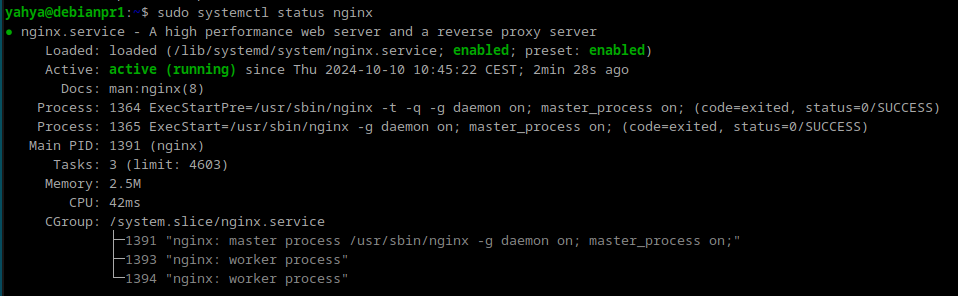

## Creacion de la carpeta de la web
Creacion de la carpeta de la web en /var/www/
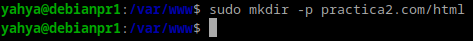

Inicializar el repositorio git, y clonar el repo https://github.com/cloudacademy/statis-website-example
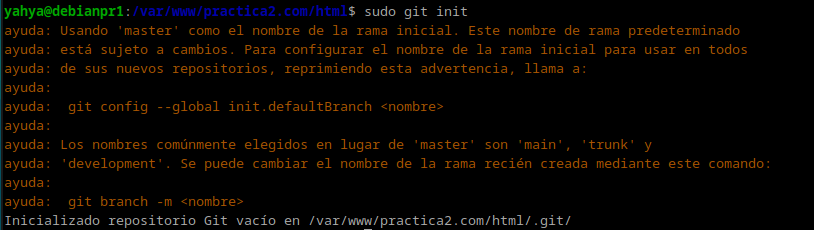
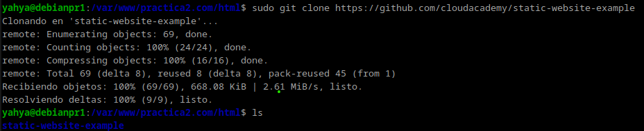

Dar permisos al usuario `yahya`

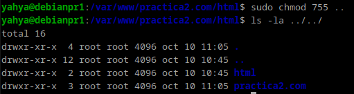

Comprobacion del funcionamiento de Nginx
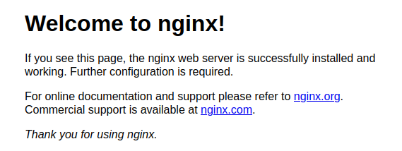

## Configuración de servidor web NGINX
Abrimos el fichero de configuracion /etc/nginx/sites-available/vuestro_dominio
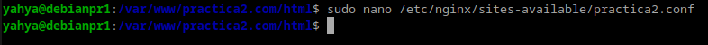

Configurarlo                                   
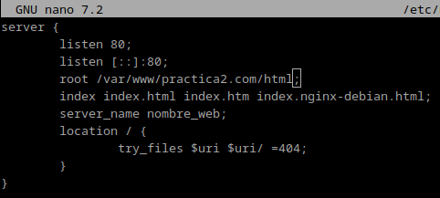

Crear el archivo simbolico al sites-enabled                         
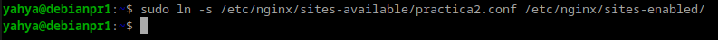

Reiniciar el servidor                                 
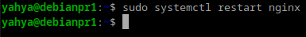

Modificar el archivo C:\Windows\System32\drivers\etc\hosts poniendole la ip del servidor
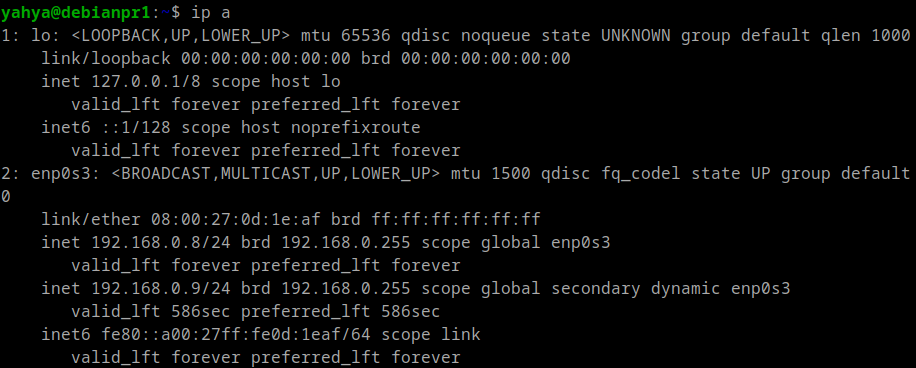
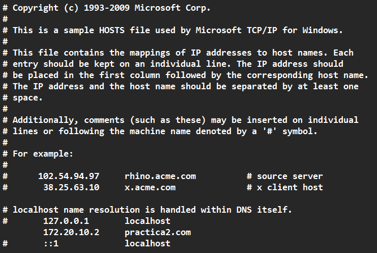

## FTP
El FTP es un protocolo de transferencia de archivos entre sistemas conectados a una red TCP. Como su nombre indica, se trata de un protocolo que permite transferir archivos directamente de un dispositivo a otro. 

## Configuracion SFTP en Debian
Instalamos vsftpd                                             
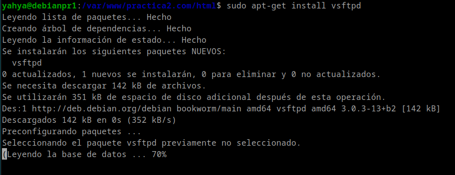

Creamos una carpeta ftp en /home/yahya                                             
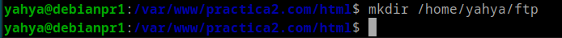

Creamos los certitificados de seguridad de la conexion
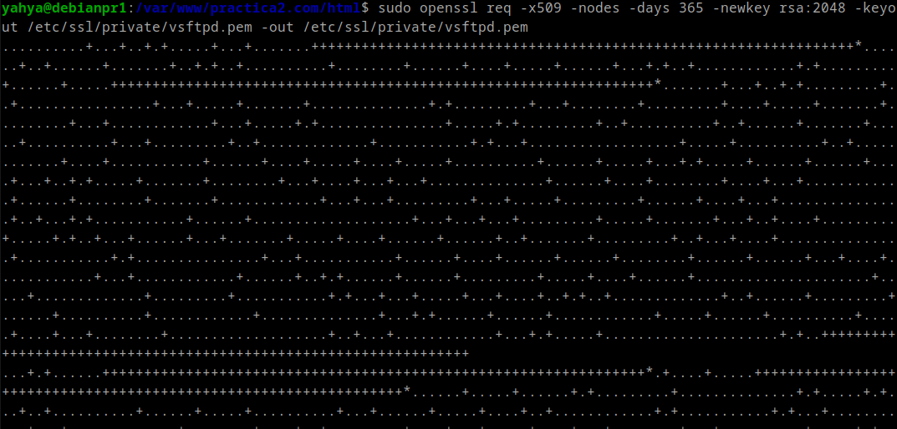

Configurar vsftpd
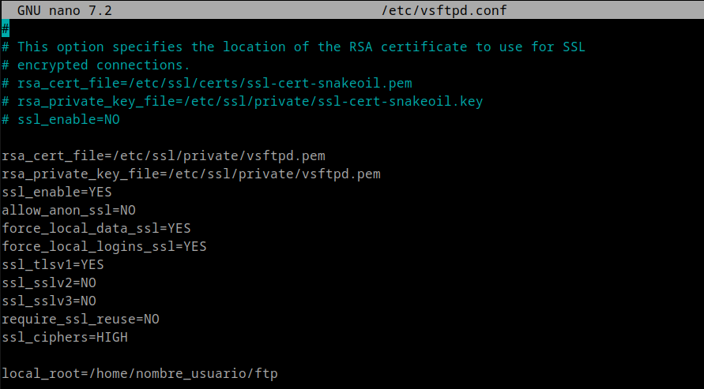

Reiniciar el servicio vsdtpd
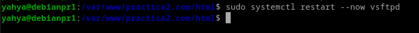

Conexion a filezilla
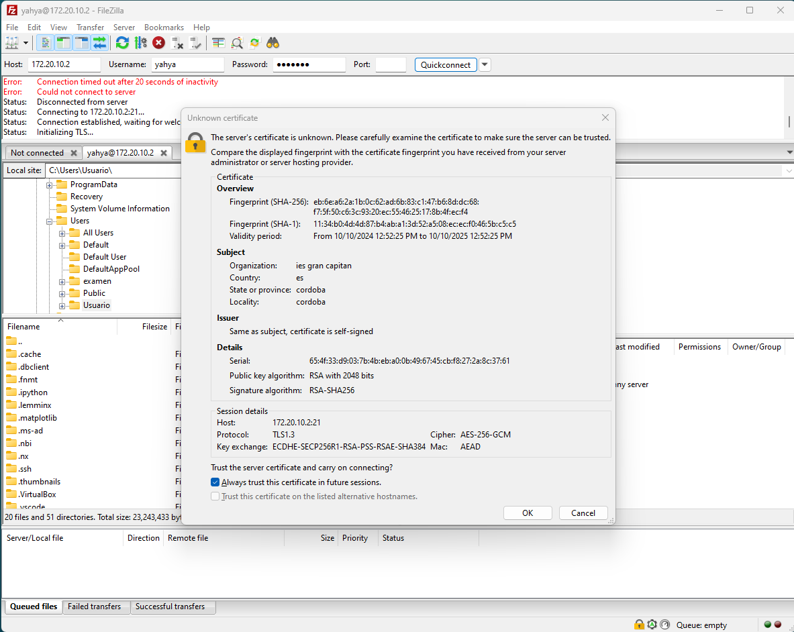

Drop the zipfile
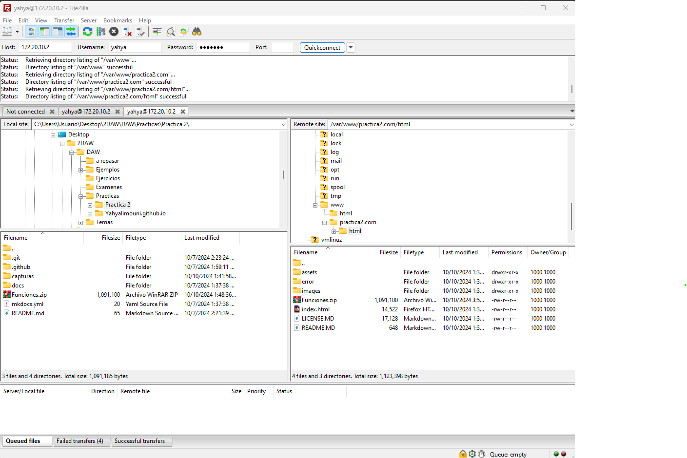

Unzip it using the command:
`unzip Funciones.zip`

